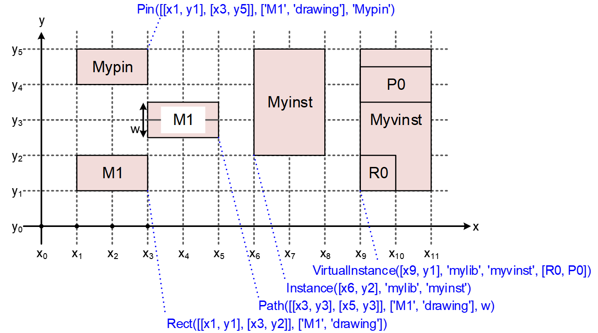
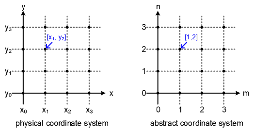
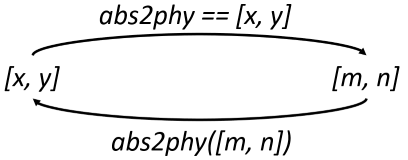
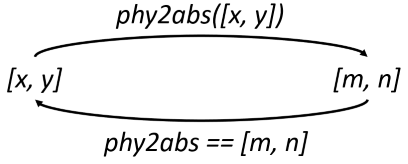
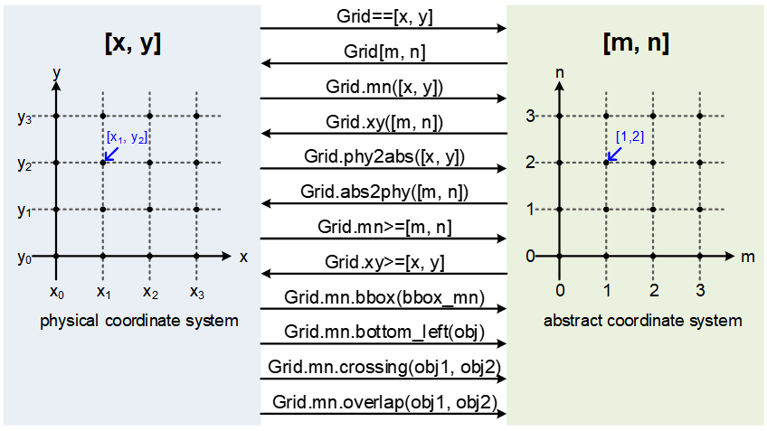
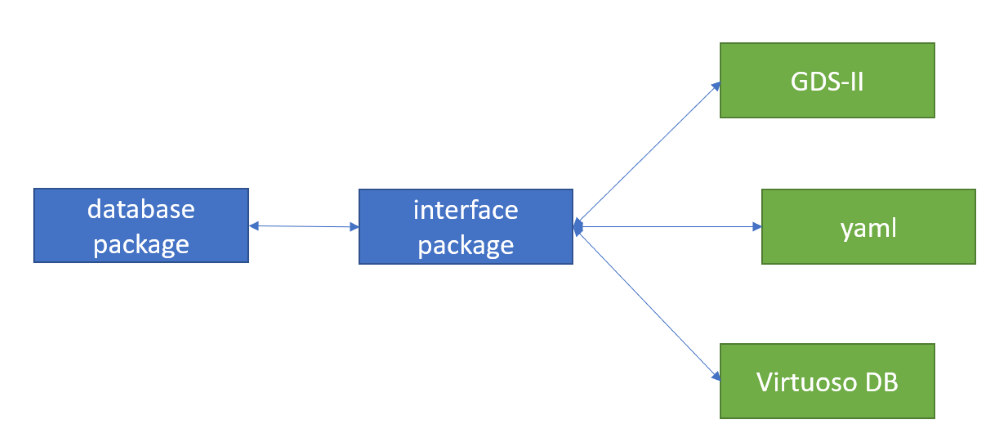

# Laygo2 Structure

laygo2 is composed of the following sub-packages.
* **[object package](#object-package)** implements various physical and abstract objects that compose layouts.
* **[interface package](#interface-package)** handles various interactions between laygo2 and external objects 
(EDA tools, data structures, files).
* **[util package](#util-package)** contains useful functions for other sub-packages.

The following figure illustrates a UML diagram of laygo2.

Introductions to the sub-packages can be found in the following sections, and see the API documentation 
(to be added) for more detailed explanations.

## object package
The object package includes various classes that are related to various physical and abstract object for 
layout generation processes and final results. There are various modules that compose the object package:

* **[physical module](#physical-module)** is about physical objects that compose actual IC layouts.
* **[template module](#template-module)** describes various classes for templates that generate various 
instance objects.
* **[grid module](#grid-module)** includes grid classes that are implemented for process portability and 
parameterizations.
* **[database module](#database-module)** implements the hierarchy of designs for database management.

### physical module
The physical module consists of classes corresponding to various physical objects for IC layout design.
Here are the summary of classes in the physical module:

* **[PhysicalObject](#PhysicalObject-class)** is the most basic class for physical objects.
* **[IterablePhysicalObject](#IterablePhysicalObject-class)**(PhysicalObject) is the most basic class for 
'iterable' physical objects (e.g. arrays and groups).
* **[PhysicalObjectGroup](#PhysicalObjectGroup-class)**(IterablePhysicalObject) is a dedicated class for 
physical object groups (to be implemented).
* **[Rect](#Rect-class)**(PhysucalObject) is for rect objects.
* **[Path](#Path-class)**(PhysicalObject) is for path objects.
* **[Pin](#Pin-class)**(IterablePhysicalObject) is for pin objects.
* **[Text](#Text-class)**(PhysicalObject) is for text objects.
* **[Instance](#Instance-class)**(IterablePhysicalObject) is for instances.
* **[VirtualInstance](#VirtualInstance-class)**(IterablePhysicalObject) is for virtual instances 
(instances that do not exist explict in design hierarachies).

The following figure shows various examples of generating physical objects using the classes introduced.

#### PhysicalObject class
PhysicalObject class implements basic physical objects and their operations, with their properties and 
methods introduced here:

* **Major attributes**
    * **name**: *str*, the name of the object.
    * **xy**: *numpy.ndarray(np.int)*, the position of the object, in physical(xy) coordinate.
    * **bbox**: *numpy.ndarray(np.int)*, the bounding box of the object.
    * **master**: *PhysicalObject or None*, (if the object is an element of another object) 
    the object's master object.
    * **params**: *Dict*, the object's properties.
    * **pointers**: *Dict*, major points (coordinates) related to the object.
    * **left, right, top, bottom, center, bottom_left, bottom_right, top_left, top_right**: 
    *numpy.ndarray(np.int)*, major points (coordinates) related to the object.

* **Major methods**
    * **\_\_init\_\_(xy, name, params=None)**: constructor.

#### IterablePhysicalObject class
IterablePhysicalObject class implements iterable and/or arrayed objects with attributes and methods 
described as follows:

* **Major attributes**
    * **name**: Refer to [PhysicalObject](#PhysicalObject-class).
    * **xy**: Refer to [PhysicalObject](#PhysicalObject-class).
    * **bbox**: Refer to [PhysicalObject](#PhysicalObject-class).
    * **master**: Refer to [PhysicalObject](#PhysicalObject-class).
    * **params**: Refer to [PhysicalObject](#PhysicalObject-class).
    * **pointers**: Refer to [PhysicalObject](#PhysicalObject-class).
    * **left, right, top, bottom, center, bottom_left, bottom_right, top_left, top_right**: 
    Refer to [PhysicalObject](#PhysicalObject-class).
    * **elements**: *numpy.ndarray(PhysicalObject)*, the elements of the object.
    * **shape**: *numpy.ndarray(np.int)*, the shape of the elements.

* **Major methods**
    * **\_\_init\_\_(xy, name=None, params=None, elements=None)**: constructor.
    * **ndenumerate()**: run ndenumerate() over the object's elements.

#### PhysicalObjectGroup class
(To be implemented) PhysicalObjectGroup class implements a group of physical objects.

#### Rect class
Rect class implements rectangular objects.

* **Major attributes**
    * **name**: refer to [PhysicalObject](#PhysicalObject-class).
    * **xy**: *np.ndarray(dtype=np.int)*, xy-coordinate values of bottom-left top-right corners.
    * **bbox**: refer to [PhysicalObject](#PhysicalObject-class).
    * **master**: refer to [PhysicalObject](#PhysicalObject-class).
    * **params**: refer to [PhysicalObject](#PhysicalObject-class).
    * **pointers**: refer to [PhysicalObject](#PhysicalObject-class).
    * **left, right, top, bottom, center, bottom_left, bottom_right, top_left, top_right**: refer to [PhysicalObject](#PhysicalObject-class).
    * **layer**: *[str, str]*, the layer information of the object. 
    * **netname**: *str*, the net name of the object.
    * **hextension**: *int*, the extension of the object in horizontal directions.
    * **vextension**: *int*, the extension of the object in vertical directions.
    * **height**: *int*, the height of the object.
    * **width**: *int*, the width of the object.
    * **size**: *np.array(dtype=np.int)*, the size [width, height] of the object.
    
* **Major methods**
    * **\_\_init\_\_(xy, layer, hextension=0, vextension=0, name=None, netname=None, params=None)**: constructor.

#### Path class
Path class implements path objects.

* **Major attributes**
    * **name**: refer to [PhysicalObject](#PhysicalObject-class).
    * **xy**: *np.ndarray(dtype=np.int)*, the xy-coordinates of the path object.
    * **bbox**: refer to [PhysicalObject](#PhysicalObject-class).
    * **master**: refer to [PhysicalObject](#PhysicalObject-class).
    * **params**: refer to [PhysicalObject](#PhysicalObject-class).
    * **layer**: *[str, str]*, the layer information of the path. 
    * **netname**: *str*, the net name of the path.
    * **extension**: *int*, the extension of the path.
    * **width**: *int*, the width of the object.
    
* **Major methods**
    * **\_\_init\_\_(xy, layer, width, extension=0, name=None, netname=None, params=None)**: constructor.

#### Pin class
Pin classes implements pin objects for terminals of designs and instances.

* **Major attributes**
    * **name**: refer to [IterablePhysicalObject](#IterablePhysicalObject-class).
    * **xy**: the xy-coordinates of bottom-left and top-right corners of the object.
    * **bbox**: refer to [IterablePhysicalObject](#IterablePhysicalObject-class).
    * **master**: *Instance or VirtualInstance*, (if the pin object belongs to an instance)
    the master instance of the pin object.
    * **params**: refer to [IterablePhysicalObject](#IterablePhysicalObject-class).
    * **pointers**: refer to [IterablePhysicalObject](#IterablePhysicalObject-class).
    * **left, right, top, bottom, center, bottom_left, bottom_right, top_left, top_right**: 
    [IterablePhysicalObject](#IterablePhysicalObject-class).
    * **elements**: refer to [IterablePhysicalObject](#IterablePhysicalObject-class).
    * **shape**: refer to [IterablePhysicalObject](#IterablePhysicalObject-class).
    * **layer**: *[str, str]*, the layer information of the object. 
    * **netname**: *str*, the net name of the object.
    * **height**: *int*, the height of the object.
    * **width**: *int*, the width of the object.
    * **size**: *np.array(dtype=np.int)*, the size of the object.

* **Major methods**
    * **\_\_init\_\_(xy, layer, name=None, netname=None, params=None, master=None, elements=None)**: constructor.
    * **ndenumerate()**: refer to [IterablePhysicalObject](#IterablePhysicalObject-class).
    * **export_to_Dict()**: returns a dictionary that contains the object's information.

#### Text class
Text class implements text labels.

* **Major attributes**
    * **name**: refer to [PhysicalObject](#PhysicalObject-class).
    * **xy**: refer to [PhysicalObject](#PhysicalObject-class).
    * **bbox**: refer to [PhysicalObject](#PhysicalObject-class).
    * **master**: refer to [PhysicalObject](#PhysicalObject-class).
    * **params**: refer to [PhysicalObject](#PhysicalObject-class).
    * **pointers**: refer to [PhysicalObject](#PhysicalObject-class).
    * **left, right, top, bottom, center, bottom_left, bottom_right, top_left, top_right**: refer to [PhysicalObject](#PhysicalObject-class).
    * **layer**: *[str, str]*, the layer information of the object. 
    * **text**: *str*, the text information of the object.
    
* **Major methods**
    * **\_\_init\_\_(xy, layer, text, name=None, params=None): constructor.

#### Instance class
Instance class impelments single instances or instance arrays.

* **Major attributes**
    * **name**: refer to [IterablePhysicalObject](#IterablePhysicalObject-class).
    * **xy**: the xy-coordinates of bottom-left and top-right corners.
    * **bbox**: refer to [IterablePhysicalObject](#IterablePhysicalObject-class).
    * **master**: *Instance or VirtualInstance*, (if the instance belongs to a specific instance)
    the object's master instance.
    * **params**: refer to [IterablePhysicalObject](#IterablePhysicalObject-class).
    * **pointers**: refer to [IterablePhysicalObject](#IterablePhysicalObject-class).
    * **left, right, top, bottom, center, bottom_left, bottom_right, top_left, top_right**: 
    [IterablePhysicalObject](#IterablePhysicalObject-class).
    * **elements**: refer to [IterablePhysicalObject](#IterablePhysicalObject-class).
    * **shape**: refer to [IterablePhysicalObject](#IterablePhysicalObject-class).
    * **libname**: *str*, the library name of the object.
    * **cellname**: *str*, the cell name of the object.
    * **unit_size**: *np.array(dtype=np.int)* the unit-size of the instance, when the instance is an array. 
    * **transform**: *str*, the transform parameter of the object. 
    * **pins**: *Dict[Pin]*, the dictionary that contains the instance's pins.
    * **xy0**: *np.array(dtype=np.int)*, the xy-coordinate values of the object's primary corner.
    * **xy1**: *np.array(dtype=np.int)*, the xy-coordinate values of the object's secondary corner.
    * **size**: *np.array(dtype=np.int)*, the size of the object.
    * **pitch**: *np.array(dtype=np.int)*, the pitch between unit-cells of the object.
    * **spacing**: same as pitch *(introduced to align the notation with GDS-II).*
    * **height**: *int*, the height of the object.
    * **width**: *int*, the width of the object.

* **Major methods**
    * **\_\_init\_\_(xy, libname, cellname, shape=None, pitch=None, transform='R0', unit_size=np.array([0, 0]), 
    pins=None, name=None, params=None)**: constructor.
    * **ndenumerate()**: refer to [IterablePhysicalObject](#IterablePhysicalObject-class).

#### VirtualInstance class
VirtualInstance class implements single virtual instances or virtual instance arrays that are composed of 
multiple physical objects.

* **Major attributes**
    * **name**: refer to [IterablePhysicalObject](#IterablePhysicalObject-class).
    * **xy**: the xy-coordinates of bottom-left and top-right corners.
    * **bbox**: refer to [IterablePhysicalObject](#IterablePhysicalObject-class).
    * **master**: *Instance or VirtualInstance*, (if the instance belongs to another instance, 
    e.g., unit cell of an instance array)
    the object's master instance.
    * **params**: refer to [IterablePhysicalObject](#IterablePhysicalObject-class).
    * **pointers**: refer to [IterablePhysicalObject](#IterablePhysicalObject-class).
    * **left, right, top, bottom, center, bottom_left, bottom_right, top_left, top_right**: 
    [IterablePhysicalObject](#IterablePhysicalObject-class).
    * **elements**: refer to [IterablePhysicalObject](#IterablePhysicalObject-class).
    * **shape**: refer to [IterablePhysicalObject](#IterablePhysicalObject-class).
    * **libname**: refer to [Instance](#Instance-class).
    * **cellname**: refer to [Instance](#Instance-class).
    * **unit_size**: refer to [Instance](#Instance-class). 
    * **transform**: refer to [Instance](#Instance-class). 
    * **pins**: refer to [Instance](#Instance-class).
    * **xy0**: refer to [Instance](#Instance-class).
    * **xy1**: refer to [Instance](#Instance-class).
    * **size**: refer to [Instance](#Instance-class).
    * **pitch**: refer to [Instance](#Instance-class).
    * **spacing**: refer to [Instance](#Instance-class).
    * **height**: refer to [Instance](#Instance-class).
    * **width**: refer to [Instance](#Instance-class).
    * **native_elements**: *Dict[PhysicalObject]*, the dictionary that contains physical objects that compose 
    the virtual instance. Its key names are the names of the physical objects.

* **Major methods**
    * **\_\_init\_\_(xy, libname, cellname, native_elements, shape=None, pitch=None, transform='R0', unit_size=np.array([0, 0]), 
    pins=None, name=None, params=None)**: constructor.
    * **ndenumerate()**: refer to [IterablePhysicalObject](#IterablePhysicalObject-class).

### template module
template module is composed of classes that abstract instances and virtual instances described as follows:

* **[Template](#Template-class)** is the basic templates class.
* **[NativeInstanceTemplate](#NativeInstanceTemplate-class)**(Template) is a template class that generates Instance 
objects.
* **[ParameterizedInstanceTemplate](#ParameterizedInstanceTemplate-class)**(Template) 
generates ParameterizedInstance objects with its user-defined bbox function. 
* **[UserDefinedTemplate](#UserDefinedTemplate-class)**(Template)
generates VirtualInstance objects with its bbox / pins / generate functions.

#### Template class
Template class implements basic template functions with its attributes and methods described as follows:

* **Major attributes**
    * **name**: *str*, the name of the template.

* **Major methods**
    * **\_\_init\_\_(name)**: constructor.
    * **height(params=None)**: returns the height of the template corresponding to params.
    * **width(params=None)**: returns the width of the template corresponding to params.
    * **size(params=None)**: returns the size of the template.
    * **bbox(params=None)**: (abstract method) returns the bounding box of the template.
    * **pins(params=None)**: (abstract method) returns a dictionary that contains the pins of the template.
    * **generate(name=None, shape=None, pitch=np.array([0, 0]), transform='R0', params=None)**: 
    (abstract method) returns an instance object generated from the template.
    
#### NativeInstanceTemplate class
NativeInstanceTemplate class implements templates that returns basic Instance objects with its attributes and methods 
described as follows:

* **Major attributes**
    * **name**: refer to [Template](#Template-class).
    * **libname**: *str*, the library name of the generated instance.
    * **cellname**: *str*, the cell name of the generated instance.

* **Major methods**
    * **\_\_init\_\_(libname, cellname, bbox=np.array([[0, 0], [0, 0]]), pins=None)**: constructor.
    * **bbox(params=None)**: refer to [Template](#Template-class).
    * **pins(params=None)**: refer to [Template](#Template-class).
    * **generate(name=None, shape=None, pitch=np.array([0, 0]), transform='R0', params=None)**: 
    [Template](#Template-class).
    * **export_to_dict()**: returns a dictionary that contains the template's information.

#### ParameterizedInstanceTemplate class
ParameterizedInstanceTemplate class implements a template that returns parameterized Instance objects,
with its attributes and methods described as follows:

* **Major attributes**
    * **name**: refer to [Template](#Template-class).
    * **libname**: refer to [NativeInstanceTemplate](#NativeInstanceTemplate-class).
    * **cellname**: refer to [NativeInstanceTemplate](#NativeInstanceTemplate-class).

* **Major methods**
    * **\_\_init\_\_(libname, cellname, bbox_func=None, pins_func=None)**: constructor.
    * **bbox(params=None)**: refer to [Template](#Template-class).
    * **pins(params=None)**: refer to [Template](#Template-class).
    * **generate(name=None, shape=None, pitch=np.array([0, 0]), transform='R0', params=None)**: 
    [Template](#Template-class).

#### UserDefinedTemplate class
UserDefinedTemplate class implements a template that returns VirtualInstance objects, with its attributes 
and methods described as follows:

* **Major attributes**
    * **name**: refer to [Template](#Template-class).
    * **libname**: refer to [NativeInstanceTemplate](#NativeInstanceTemplate-class).
    * **cellname**: refer to [NativeInstanceTemplate](#NativeInstanceTemplate-class).

* **Major methods**
    * **\_\_init\_\_(bbox_func, pins_func, generate_func, name=None)**: constructor.
    * **bbox(params=None)**: refer to [Template](#Template-class).
    * **pins(params=None)**: refer to [Template](#Template-class).
    * **generate(name=None, shape=None, pitch=np.array([0, 0]), transform='R0', params=None)**: 
    [Template](#Template-class).

### grid module
grid module is composed of classes that implement abstract coordinate systems that are interacting with 
technology-specific physical coordinate systems.

laygo2 implements the layout designs based on the abstract coordinate system.

Grid module implements the following classes.

* **[CircularMapping](#CircularMapping-class)**: basic circular mapping class.
* **[CircularMappingArray](#CircularMappingArray-class)**(CircularMapping): a multi-dimensional circular mapping class.
* **[_AbsToPhyGridConverter](#_AbsToPhyGridConverter-class)**: an abstract-to-physical coordinate converter class.
* **[_PhyToAbsGridConverter](#_PhyToAbsGridConverter-class)**: a physical-to-abstract coordinate converter class.
* **[OneDimGrid](#OneDimGrid-class)**(CircularMapping): an one-dimensional grid classes
* **[Grid](#Grid-class)**: a two-dimensional grid classes.
* **[PlacementGrid](#PlacementGrid-class)**(Grid): a 2-dimensional grid class for instance placement.
* **[RoutingGrid](#RoutingGrid-class)**(Grid): a 2-dimensional grid class for wire routing.

#### CircularMapping class
CircularMapping class implements basic circular mappings (their indices extend to the entire axis with cyclic mapping).
The following code block shows several examples of using CircularMapping objects.

    >>> map = CircularMapping(elements=[100, 200, 300])
    >>> print(map[0])
    100
    >>> print(map[2])
    300
    >>> print(map[4])
    200
    >>> print(map[-3])
    100
    >>> print(map[[2, 3, -2])
    [300, 100, 200]
    >>> print(map[2:7])
    [300, 100, 200, 300, 100]
    
CircularMapping class contains various attributes and methods described as follows:

* **Major attributes**
    * **dtype**: *type*, the data type of the mapping.
    * **elements**: *numpy.array(dtype=self.dtype)*, the array that contains the components of the circular mapping.
    * **shape**: *numpy.array(dtype=numpy.int)*, the shape of the circular mapping.

* **Major methods**
    * **\_\_init\_\_(elements, dtype=np.int)**: constructor.
    * **\_\_getitem\_\_(pos)**: accesses component(s) of the circular mapping.
    * **\_\_iter\_\_()**: the iteration function of the circular mapping.
    * **\_\_next\_\_()**: the next element access function of the circular mapping.

#### CircularMappingArray class
CircularMappingArray class implements multi-dimensional circular mappings (their indices extend to the entire axis with
 cyclic mapping) and is used for expressing multi-dimensional arrays with cyclic indexing (e.g. a 2-dim via map).
CircularMappingArray includes the following attributes and methods.

* **Major attributes**
    * **dtype**: 
    [CircularMapping](#CircularMapping-class).
    * **elements**: refer to [CircularMapping](#CircularMapping-class).
    * **shape**: refer to [CircularMapping](#CircularMapping-class).

* **Major methods**
    * **\_\_init\_\_(elements, dtype=np.int)**: refer to [CircularMapping](#CircularMapping-class).
    * **\_\_getitem\_\_(pos)**: refer to [CircularMapping](#CircularMapping-class).
    * **\_\_iter\_\_()**: refer to [CircularMapping](#CircularMapping-class).
    * **\_\_next\_\_()**: refer to [CircularMapping](#CircularMapping-class).

#### _AbsToPhyGridConverter class
_AbsToPhyGridConverter is an internal class that converts abstract coordinates to physical coordinates. 
It also supports reverse conversions (physical-to-abstract) with comparison operators 
(which requires its pair converter class, _PhyToAbsGridConverter defined in its master grid object).

_AbsToPhyGridConverter class contains various attributes and methods described as follows:

* **Major attributes**
    * **master**: *OneDimGrid or Grid*, the grid object which the object belongs to.

* **Major methods**
    * **\_\_init\_\_(master)**: constructor.
    * **\_\_getitem\_\_(pos)**: element access function for the object. Receives the abstract coordinate as its input 
    and converts it to a physical coordinate.
    * **\_\_call\_\_(pos)**: element access function for the object. Receives the abstract coordinate as its input 
    * **\_\_eq\_\_(other), \_\_lt\_\_(other), \_\_le\_\_(other), \_\_gt\_\_(other), \_\_ge\_\_(other)**:
    (reverse conversion function) Returns abstract coordinates that meet the comparison operator conditions.

#### _PhyToAbsGridConverter class
_PhyToAbsGridConverter is an internal class that converts physical coordinates to abstract coordinates.
It also supports reverse conversions (abstract-to-physical) with comparison operators
(which requires its pair converter class, _AbsToPhyGridConverter defined in its master grid object).

_PhyToAbsGridConverter class contains various attributes and methods described as follows:

* **Major attributes**
    * **master**: *OneDimGrid or Grid*, the grid object which the object belongs to.

* **Major methods**
    * **\_\_init\_\_(master)**: constructor.
    * **\_\_call\_\_(pos)**: element access function. Receives a physical coordinate as its input 
    and converts it to an abstract coordinate.
    * **\_\_getitem\_\_(pos)**: element access function. Receives a physical coordinate as its input 
    and converts it to an abstract coordinate.
    * **\_\_eq\_\_(other), \_\_lt\_\_(other), \_\_le\_\_(other), \_\_gt\_\_(other), \_\_ge\_\_(other)**:
    (reverse conversion function) Returns physical coordinates that meet the comparison operator conditions.
    * **bbox(obj)**: converts the bounding box of obj to abstract coordinates.
    * **bottom_left(obj)**: returns the bottom-left corner of obj in abstract coordinate.
    * **bottom_right(obj)**: returns the bottom-right corner of obj in abstract coordinate.
    * **top_left(obj)**: returns the top-left corner of obj in abstract coordinate.
    * **top_right(obj)**: returns the top-right corner of obj in abstract coordinate.
    * **width(obj)**: returns the width of obj.
    * **height(obj)**: returns the height of obj.
    * **size(obj)**: returns the size([width, height]) of obj.
    * **crossing(\*args)**: returns the crossing point of *args in abstract coordinate.
    * **overlap(\*args, type='bbox')**: converts the overlap region of *args to abstract coordinates, in the type 
    specified in the type argument. 
    If type='bbox', a bounding box corresponding to the overlap region is returned. 
    If type='array', all points on the abstract grid inside the bounding box are returned as the form of a 2-d array.
    If type='list', all points on the abstract grid inside the bounding box are returned as the form of a 1-d list.
    * **union(\*args)**: returns the union of *args, in the form of a bounding box.
    
#### OneDimGrid class
OneDimGrid class implements a one-dimensional abstract coordinate system, with the attributes and methods introduced.

* **Major attributes**
    * **name**: *str*, the name of coordinate system.
    * **range**: *numpy.ndarray(dtype=np.int)*, the region where the coordinate system is defined.
    The grid system extends over the defined range, repeating the coordinate values.
    * **phy2abs**: *_PhyToAbsConverter*, a physical-to-abstract coordinate converter.
    * **abs2phy**: *_AbsToPhyConverter*, a abstract-to-physical coordinate converter.
    * **width**: *int*, the width of the range where the grid is defined.
    
* **Major methods**
    * **\_\_init\_\_(name, scope, elements=np.array([0]))**: constructor.
    * **\_\_getitem\_\_(pos)**: element access function. Receives an abstract coordinate and convert it to a physical 
    coordinate.
    * **\_\_eq\_\_(other), \_\_lt\_\_(other), \_\_le\_\_(other), \_\_gt\_\_(other), \_\_ge\_\_(other)**:
    Returns a physical coordinate that meets the comparison operation condition.
    * **export_to_dict()**: returns a dict that contains the grid's information.

#### Grid class
Grid class implements an abstract coordinate that is mapped to a 2-dimensional physical coordinate system.

The Grid class and its objects support various coordinate conversion functions, with their examples introduced in the 
following figure.

 
The grid class contains the following attributes and methods.

* **Major attributes**
    * **name**: *str*, the name of the grid.
    * **range**: *numpy.ndarray(dtype=np.int)*, the range where the grid system is defined.
    The grid system extends over the defined range, repeating the coordinate values.
    * **phy2abs**: *PhyToAbsConverter*, a physical-to-abstract grid converter object.
    * **abs2phy**: *AbsToPhyConverter*, an abstract-to-physical grid converter object.
    * **xy**: *List[OneDimGrid]*, a list that contains 1-dimensional grids for x and y axises.
    * **x**: *OneDimGrid*, a one-dimensional grid system in x-axis.
    * **y**: *OneDimGrid*, a one-dimensional grid system in y-axis.
    * **v**: same as x.
    * **h**: same as y.
    * **mn**: same as abs2phy.
    * **width**: *int*, the width of the region where the grid system is defined.
    * **height**: *int*, the height of the region where the grid system is defined. 
     
* **Major methods**
    * **\_\_init\_\_(name, scope, elements=np.array([0]))**: constructor.
    * **\_\_getitem\_\_(pos)**: element access function. Receives abstract coordinates and convert them to physical 
    ones. 
    * **\_\_eq\_\_(other), \_\_lt\_\_(other), \_\_le\_\_(other), \_\_gt\_\_(other), \_\_ge\_\_(other)**:
    returns physical coordinates that meet the comparison conditions.
    * **bbox(obj)**: refer to [_PhyToAbsGridConverter](#_PhyToAbsGridConverter-class).
    * **bottom_left(obj)**: refer to [_PhyToAbsGridConverter](#_PhyToAbsGridConverter-class).
    * **bottom_right(obj)**: refer to [_PhyToAbsGridConverter](#_PhyToAbsGridConverter-class).
    * **top_left(obj)**: refer to [_PhyToAbsGridConverter](#_PhyToAbsGridConverter-class).
    * **top_right(obj)**: refer to [_PhyToAbsGridConverter](#_PhyToAbsGridConverter-class).
    * **width(obj)**: refer to [_PhyToAbsGridConverter](#_PhyToAbsGridConverter-class).
    * **height(obj)**: refer to [_PhyToAbsGridConverter](#_PhyToAbsGridConverter-class).
    * **size(obj)**: refer to [_PhyToAbsGridConverter](#_PhyToAbsGridConverter-class).
    * **crossing(\*args)**: refer to [_PhyToAbsGridConverter](#_PhyToAbsGridConverter-class).
    * **overlap(\*args, type='bbox')**: refer to [_PhyToAbsGridConverter](#_PhyToAbsGridConverter-class).
    * **union(\*args)**: refer to [_PhyToAbsGridConverter](#_PhyToAbsGridConverter-class).

#### PlacementGrid class
PlacementGrid class implements abstract grids for placing Instance and VirtualInstance objects with the attributes and 
methods described as follows:

* **Major attributes**
    * **name**: refer to [Grid](#Grid-class).
    * **range**: refer to [Grid](#Grid-class).
    * **phy2abs**: refer to [Grid](#Grid-class).
    * **abs2phy**: refer to [Grid](#Grid-class).
    * **xy**: refer to [Grid](#Grid-class).
    * **x**: refer to [Grid](#Grid-class).
    * **y**: refer to [Grid](#Grid-class).
    * **v**: refer to [Grid](#Grid-class).
    * **h**: refer to [Grid](#Grid-class).
    * **mn**: refer to [Grid](#Grid-class).
    * **width**: refer to [Grid](#Grid-class).
    * **height**: refer to [Grid](#Grid-class).
    * **type**: *str*, the type of the grid. Its value should be 'placement' for PlacementGrid objects.
     
* **Major methods**
    * **\_\_init\_\_(name, scope, elements=np.array([0]))**: constructor.
    * **\_\_getitem\_\_(pos)**: element access function. Receives abstract coordinates and convert them to physical 
    ones. 
    * **\_\_eq\_\_(other), \_\_lt\_\_(other), \_\_le\_\_(other), \_\_gt\_\_(other), \_\_ge\_\_(other)**:
    returns physical coordinates that meet the comparison conditions.
    * **bbox(obj)**: refer to [Grid](#Grid-class).
    * **bottom_left(obj)**: refer to [Grid](#Grid-class).
    * **bottom_right(obj)**: refer to [Grid](#Grid-class).
    * **top_left(obj)**: refer to [Grid](#Grid-class).
    * **top_right(obj)**: refer to [Grid](#Grid-class).
    * **width(obj)**: refer to [Grid](#Grid-class).
    * **height(obj)**: refer to [Grid](#Grid-class).
    * **size(obj)**: refer to [Grid](#Grid-class).
    * **crossing(\*args)**: refer to [Grid](#Grid-class).
    * **overlap(\*args, type='bbox')**: refer to [Grid](#Grid-class).
    * **union(\*args)**: refer to [Grid](#Grid-class).

#### RoutingGrid class
RoutingGrid class implements abstract grids for routing wires and vias with the attributes and 
methods described as follows:

* **Major attributes**
    * **name**: refer to [Grid](#Grid-class).
    * **range**: refer to [Grid](#Grid-class).
    * **phy2abs**: refer to [Grid](#Grid-class).
    * **abs2phy**: refer to [Grid](#Grid-class).
    * **xy**: refer to [Grid](#Grid-class).
    * **x**: refer to [Grid](#Grid-class).
    * **y**: refer to [Grid](#Grid-class).
    * **v**: refer to [Grid](#Grid-class).
    * **h**: refer to [Grid](#Grid-class).
    * **mn**: refer to [Grid](#Grid-class).
    * **width**: refer to [Grid](#Grid-class).
    * **height**: refer to [Grid](#Grid-class).
    * **type**: *str*, the type of the grid. Its value should be 'routing' for RoutingGrid objects.
    * **vwidth**: *CircularMapping*, the widths of vertical wires.
    * **hwidth**: *CircularMapping*, the widths of horizontal wires.
    * **vextension**: *CircularMapping*, the extensions of vertical wires.
    * **hextension**: *CircularMapping*, the extensions of horizontal wires.
    * **vlayer**: *CircularMapping*, the layer information of vertical wires.
    * **hlayer**: *CircularMapping*, the layer information of horizontal wires.
    * **pin_vlayer**: *CircularMapping*, the layer information of vertical pin wires.
    * **pin_hlayer**: *CircularMapping*, the layer information of horizontal pin wires.
    * **viamap**: *CircularMappingArray*, the array that contains via objects located at the intersection of vertical 
    and horizontal grids.
    * **primary_grid**: str, the default direction of wires (the direction of wires with their sizes 0).
     
* **Major methods**
    * **\_\_init\_\_(name, scope, elements=np.array([0]))**: constructor.
    * **\_\_getitem\_\_(pos)**: element access function. Receives abstract coordinates and convert them to physical 
    ones. 
    * **\_\_eq\_\_(other), \_\_lt\_\_(other), \_\_le\_\_(other), \_\_gt\_\_(other), \_\_ge\_\_(other)**:
    returns physical coordinates that meet the comparison conditions.
    * **bbox(obj)**: refer to [Grid](#Grid-class).
    * **bottom_left(obj)**: refer to [Grid](#Grid-class).
    * **bottom_right(obj)**: refer to [Grid](#Grid-class).
    * **top_left(obj)**: refer to [Grid](#Grid-class).
    * **top_right(obj)**: refer to [Grid](#Grid-class).
    * **width(obj)**: refer to [Grid](#Grid-class).
    * **height(obj)**: refer to [Grid](#Grid-class).
    * **size(obj)**: refer to [Grid](#Grid-class).
    * **crossing(\*args)**: refer to [Grid](#Grid-class).
    * **overlap(\*args, type='bbox')**: refer to [Grid](#Grid-class).
    * **union(\*args)**: refer to [Grid](#Grid-class).
    * **route(mn, direction=None, via_tag=None)**: the wire routing function. Receives the default direction of wires, 
    and via placement options at the starting, internal, and end points as its arguments.
    * **via(mn=np.array([0, 0]), params=None)**: the via placement function.
    * **pin(name, mn, direction=None, netname=None, params=None)**: the pin creation function.

### database module
database module consists classes that implement design hierarchy to manage designs and libraries with its component 
classes described as follows:

* **[BaseDatabase](#BaseDatabase-class)** is the basic database management class.
* **[Library](#Library-class)**(BaseDatabase) is the library management class.
* **[Design](#Design-class)**(BaseDatabase) is the design management class.

#### BaseDatabase class
BaseDatabase class implements the basic database management functions, with its attributes and methods described as 
 follows:

* **Major attributes**
    * **name**: *str*, the name of the database.
    * **params**: *dict or None*, the database's parameters.
    * **noname_index**: *int*, the index of unnamed objects added to the database.
    * **keys**: *list*, keys of the dictionary that stores the component objects of the database.

* **Major methods**
    * **items()**: the iteration function for its component objects.
    * **\_\_getitem\_\_(pos)**: element access function for the database.
    * **\_\_setitem\_\_(key, item)**: element setting function for the database.
    * **append(item)**: element adding function.
    * **\_\_iter\_\_()**: the iteration for the mapping.
    * **\_\_init\_\_(name, params=None, elements=None)**: constructor.
    
#### Library class
Library class implements the library management functions, with its attributes and methods described as follows:

* **Major attributes**
    * **name**: refer to [BaseDatabase](#BaseDatabase-class).
    * **params**: refer to [BaseDatabase](#BaseDatabase-class).
    * **noname_index**: refer to [BaseDatabase](#BaseDatabase-class).
    * **keys**: refer to [BaseDatabase](#BaseDatabase-class).
    * **libname**: *str*, the name of the library.

* **Major methods**
    * **items()**: refer to [BaseDatabase](#BaseDatabase-class).
    * **\_\_getitem\_\_(pos)**: refer to [BaseDatabase](#BaseDatabase-class).
    * **\_\_setitem\_\_(key, item)**: refer to [BaseDatabase](#BaseDatabase-class).
    * **append(item)**: refer to [BaseDatabase](#BaseDatabase-class).
    * **\_\_iter\_\_()**: refer to [BaseDatabase](#BaseDatabase-class).
    * **\_\_init\_\_(name, params=None, elements=None)**: constructor. 

#### Design class
Design class implements design management functions, with its attributes and methods described as follows:

* **Major attributes**
    * **name**: refer to [BaseDatabase](#BaseDatabase-class).
    * **params**: refer to [BaseDatabase](#BaseDatabase-class).
    * **noname_index**: refer to [BaseDatabase](#BaseDatabase-class).
    * **keys**: refer to [BaseDatabase](#BaseDatabase-class).
    * **libname**: *str*, the library name.
    * **cellname**: *str*, the cell name.
    * **rects**: *dict*, the dictionary that contains its Rect objects.
    * **paths**: *dict*, the dictionary that contains its Path objects.
    * **pins**: *dict*, the dictionary that contains its Pin objects.
    * **texts**: *dict*, the dictionary that contains its Text objects.
    * **instances**: *dict*, the dictionary that contains its Instance objects.
    * **virtual_instances**: *dict*, the dictionary that contains its VirtualInstance objects.

* **Major methods**
    * **items()**: refer to [BaseDatabase](#BaseDatabase-class).
    * **\_\_getitem\_\_(pos)**: refer to [BaseDatabase](#BaseDatabase-class).
    * **\_\_setitem\_\_(key, item)**: refer to [BaseDatabase](#BaseDatabase-class).
    * **append(item)**: refer to [BaseDatabase](#BaseDatabase-class).
    * **\_\_iter\_\_()**: refer to [BaseDatabase](#BaseDatabase-class).
    * **\_\_init\_\_(name, params=None, elements=None, libname=None)**: constructor. 
    * **place(inst, grid, mn)**: places an instance on the specified grid.
    * **route(grid, mn, direction=None, via_tag=None)**: routes a wire on the specified grid.
    * **via(grid, mn, params=None)**: places a via on the specified grid.
    * **pin(name, grid, mn, direction=None, netname=None, params=None)**: places a pin on the specified grid.
    * **export_to_template(libname=None, cellname=None)**: generates a template for the design.

## interface package
interface package includes classes and functions that interact with laygo2 and external EDA tools or data structures.

* **gds module** contains various functions to store the layout structures in GDS-II format, which is the most popular 
format to store layout structures.
* **yaml module** contains various I/O functions to express designs in yaml format.
* **virtuoso module** contains various functions that interacts with Cadence Virtuoso using Skill language.

## util package
util package contains various functions used in other packages.

